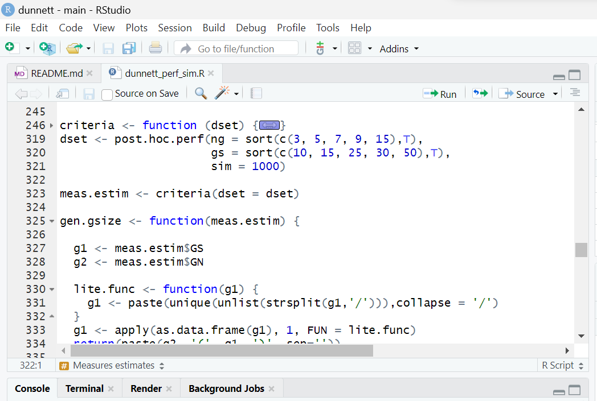
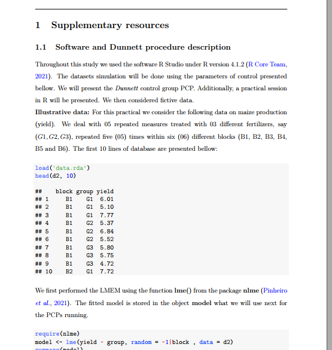

# POST HOC COMPARISON PROCEDURES PERFORMANCE
## Objective
Simulation study to analyse the performance of the **Dunnett** procedure under various violation of assumptions.

## Contents
1. simulation and analysis R code file (*dunnett_perf_sim.R*)

2. practical session for dunnett procedure in R (*additionnal_info.pdf*)

